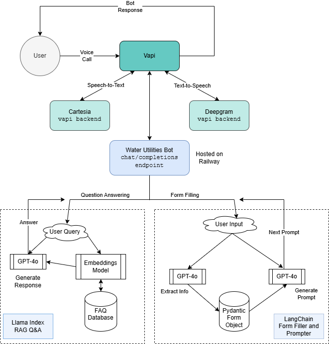

# Raleigh Water Utility AI Hotline

An AI-powered chatbot system that helps users with Raleigh water utility services through natural voice conversations. The system can answer frequently asked questions and assist filling out a Utility Assistance Application.

## Features

- **Voice-Based Interaction**: Users can interact with the system through natural phone conversations
- **FAQ Assistant**: Answers questions about Raleigh water utility services using RAG (Retrieval Augmented Generation)
- **Form Filling**: Helps users complete forms by extracting information through conversation
- **Email Integration**: Automatically sends completed forms via email

## Getting Started

### Python Setup

```bash
# Install dependencies
pip install -r requirements.txt
```

### Tools Setup

The flask app relies on several API's to run all it's functionality. You set
these up at the following links.

- [Open AI](platform.openai.com): For processing user input and generating responses
- [Google API](https://developers.google.com/maps/documentation/address-validation/get-api-key): For validating and completing addresses. Be sure to explicitly enable the [Places API](https://console.cloud.google.com/apis/library/places-backend.googleapis.com?inv=1&invt=AbqBDg&project=ai-gov-hotlin)
- [Mailer Send](mailersend.com): For emailing completed forms


### Environment Variables

Required environment variables:
- `OPENAI_API_KEY`: Your OpenAI API key
- `GOOGLE_API_KEY`: Your Googl API key
- `MAILERSEND_API_KEY`: Your Mailer Send API key
- `MAILERSEND_EMAIL`: A Valid domain for sending emails. See the [Mailersend Dashboard](https://app.mailersend.com/domains)

See all keys as specified in `.env.example`

### Running the Application

```bash
python run.py
```

The server will start and listen for incoming requests at the configured endpoint.

### API Endpoint: 

#### POST: `/chat/completions`

Handles incoming chat requests and generates appropriate responses.

**Request Format**:
```json
{
    "messages": [
        {
            "role": "user",
            "content": "user message here"
        }
    ],
    "stream": true,
}
```

**Response**: Server-sent events with content_type="text/event-stream"

### Processing Calls with Vapi

To process incoming calls with [Vapi](https://dashboard.vapi.ai/assistants), you
initiate the flask app as shown and then run `ngrok` to expose the
`/chat/completions` endpoint.
```
ngrok http 5000
```
You can then update your LLM provider on the [Vapi
Dashboard](https://dashboard.vapi.ai/assistants) to "Custom LLM" and set the
corresponding url to the one given by
[ngrok](https://dashboard.ngrok.com/endpoints) 

### Running Tests

Run pytest from the root directory
```bash
# Test the `/chat/completions` endpint
pytest
```

## System Architecture

The system integrates several components:
- Voice handling through Vapi (call management) and Deepgram (speech-to-text)
- Natural language processing using OpenAI GPT-4
- Custom Flask endpoint for response generation
- LlamaIndex for efficient FAQ querying
- LangChain for form information extraction
- Text-to-speech conversion via Cartesia


